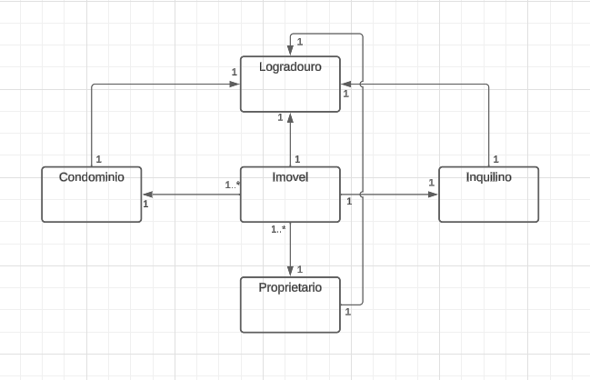

# API AdmBoaFe

### Setup

Este projeto esta estruturado em C# com Angular e utilizando o SQL Server para atender os requisitos solicitados pela Taesa.

O projeto adota 3 camadas simples:

- AdmBoaFe.Api
- AdmBoaFe.Business
- AdmBoaFe.Data

A modelagem de dados adotada para contemplar o projeto foi simples. Com as seguintes entidades:

- Entity: Classe basica para atender as demais classes, contendo apenas o Id que será comum a todas.
- Tipo Pessoa: Possuindo a referencia se a pessoa em questão é Pessoa fisica ou juridica.
- Condominio: Contendo as informações basicas do Condominio, Valor do Condominio, Contato do Sindico para rápido acesso, Contato da administradora onde é o responsavel legal da administratoda que ira tratar do condominio. Tendo relacionamento com Imovel e Logradouro.
- Imovel: Responsavel pelas informações do imovel, como quem é o proprietario, em qual condominio se encontra, qual é o inquilino que alugou o imovel e endereço (Logradouro). Fazendo relação com Condominio, Logradouro, Proprietario e inquilino.
- Inquilino: Responsavel por informar os dados inquilino e em qual imovel o mesmo alugou.
- Logradouro: Informa o endereço do imovel. A intenção desta classe foi estritamente para reduzir repetições, pois o imovel possuindo apenas o numedo do apto, em vez de possuir todo o endereço. Assim como um condominio pode possuir diversos imoveis, teria diversos registro de endereço repetidos. Por isto a separação do Logradouro com o imovel e do Condominio.
- Proprietario: Informações do Proprietario do imovel.

